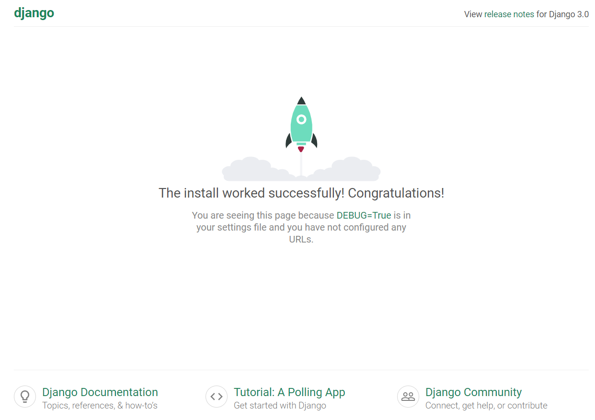

# MyCpts

## Purpose

Web based app for personal finance management, 

- using django to practice python (replacing previous version developed with php/css/js)

- will try to include some ML techniques learned at school to predict balance/budget evolution

## Architecture

- running on AWS for testing purpose

- t2.micro instance with public ip / port 8000 open

- running on ubuntu server 18.04

  ```bash
  sudo apt update
  ```

## Install / Setup MariaDB

- Install mariaDB

  ```bash
  sudo apt install mariadb-server
  ```

- secure database

  ```bash
  sudo mysql_secure_installation
  ```

- to connect remotely: 

  ```bash
  sudo nano /etc/mysql/mariadb.conf.d/50-server.cnf
  ```

  > change bind-address = 0.0.0.0

- restart service

  ```bash
  sudo service mysql restart
  ```

- service status (q to quit)

  ```bash
  sudo service mysql status
  ```

- connect to maria

  ```bash
  sudo mysql -u root -p
  ```

- create new user

  ```mysql
  grant all privileges on *.* TO 'USER_NAME'@'%' identified by 'PASSWORD';
  flush privileges;
  ```

- use heidiSQL to recreate DB from SQL exported.


## Setup / install Django

- install miniconda

  ```bash
  wget https://repo.anaconda.com/miniconda/Miniconda3-latest-Linux-x86_64.sh
  sh Miniconda3-latest-Linux-x86_64.sh
  ```

- create venv named django - activate it

  ```bash
  conda create -n django python=3.7
  conda activate django
  ```

- install django

  ```bash
  pip install django
  ```

- check install

  ```bash
  django-admin --version
  ```


## Get WIP

- clone git

  ```bash
  git clone https://github.com/terman37/Django-Website.git
  cd Django-Website
  ```


## Create Django project

- Start project (this will create new folder structure)

  ```bash
  django-admin startproject mydjangoproject
  cd mydjangoproject
  ```

- // Setup the database (using sqlite - otherwise change in settings.py)

  ```bash
  python manage.py migrate
  ```

- // Create superuser

  ```bash
  python manage.py createsuperuser
  ```

  give username / email / password

- Allow host name

  ```bash
  nano mydjangoproject/settings.py
  ```

  - Add at allowed hosts line,  

    ```
    ALLOWED_HOSTS = ['your_public_IP']
    ```

- Run development server

  ```bash
  python manage.py runserver your_private_IP:8000
  ```

- Check if it works in browser go to:

  > http://<your_public_ip>:8000
  >

  

- Admin page located at:

  > http://<your_public_ip>:8000/admin


## Create Django App

- create app

  ```bash
  python manage.py startapp appname
  ```

- modify view

  ```bash
  nano myapp/views.py
  ```

  add

  ```python
  from django.http import HttpResponse
  
  def index(request):
      return HttpResponse("Hello, world.")
  ```

- create urls

  ```
  nano myapp/urls.py
  ```

  add

  ```python
  from django.urls import path
  from . import views
  
  urlpatterns = [
      path('', views.index, name='index'),
  ]
  ```

- route urls

  ```
  nano myproject/urls.py
  ```

  modify

  ```python
  from django.contrib import admin
  from django.urls import include, path
  
  urlpatterns = [
      path('', include('appname.urls')),
      path('admin/', admin.site.urls),
  ]
  ```

  


## TIPS

- Set time zone of website:

  in settings.py update 

  ```
  TIME_ZONE = 'Europe/Paris'
  ```

  Add static path for files

- in settings.py add (at the end) 

  ```
  STATIC_ROOT = os.path.join(BASE_DIR, 'static')
  ```

  

